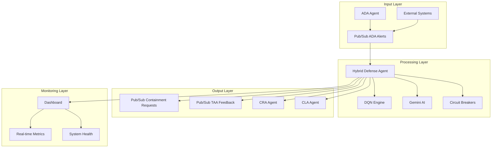

# Hybrid Cyber Defense Agent - Technical Specification

## Document Information
- **Document Title**: Hybrid Cyber Defense Agent Technical Specification
- **Version**: 1.0
- **Date**: October 2025
- **Classification**: Technical Documentation
- **Author**: AI-Driven SOC Development Team

## Executive Summary

The Hybrid Cyber Defense Agent is a sophisticated AI-powered cybersecurity system that integrates Deep Q-Network (DQN) machine learning with Google Gemini's natural language processing capabilities. This system provides real-time threat analysis, automated response recommendations, and explainable AI for cybersecurity operations.

## System Architecture

### High-Level Architecture



### Component Architecture

#### 1. Hybrid Defense Agent Core
- **Language**: Python 3.9+
- **Framework**: FastAPI
- **Port**: 8083
- **Protocol**: HTTP/HTTPS, A2A Protocol

#### 2. DQN Engine
- **Framework**: PyTorch
- **Model Type**: Deep Q-Network
- **Input**: 7-dimensional state vector
- **Output**: 5 action categories
- **Inference Time**: <100ms (target)

#### 3. Gemini Integration
- **Provider**: Google Vertex AI
- **Model**: gemini-2.0-flash-exp
- **Purpose**: Natural language explanations
- **Timeout**: 10 seconds

#### 4. Pub/Sub Integration
- **Provider**: Google Cloud Pub/Sub
- **Topics**: ada-alerts, containment-requests, taa-feedback
- **Protocol**: Asynchronous messaging
- **QoS**: At-least-once delivery

## Technical Specifications

### 1. System Requirements

#### Minimum Requirements
- **CPU**: 2 cores, 2.4 GHz
- **RAM**: 4 GB
- **Storage**: 10 GB SSD
- **Network**: 100 Mbps
- **OS**: Linux (Ubuntu 20.04+), macOS 10.15+, Windows 10+

#### Recommended Requirements
- **CPU**: 4+ cores, 3.0+ GHz
- **RAM**: 8+ GB
- **Storage**: 50+ GB NVMe SSD
- **Network**: 1 Gbps
- **GPU**: NVIDIA GPU with CUDA support (optional)

### 2. Software Dependencies

#### Core Dependencies
```python
torch>=2.0.0              # PyTorch for DQN
torchvision>=0.15.0       # Computer vision utilities
vertexai>=1.38.0          # Google Vertex AI
google-cloud-pubsub>=2.18.0  # Pub/Sub client
fastapi>=0.104.0          # Web framework
uvicorn>=0.24.0           # ASGI server
streamlit>=1.28.0         # Dashboard framework
gymnasium>=0.29.0         # RL environment
```

#### Supporting Dependencies
```python
numpy>=1.24.0             # Numerical computing
pandas>=2.0.0             # Data manipulation
matplotlib>=3.7.0         # Visualization
seaborn>=0.12.0           # Statistical visualization
requests>=2.31.0          # HTTP client
python-multipart>=0.0.6   # Form data handling
pydantic>=2.0.0           # Data validation
```

### 3. Data Models

#### Alert Message Schema
```python
@dataclass
class AlertMessage:
    alert_id: str                    # Unique identifier
    timestamp: str                   # ISO 8601 format
    source: str                      # Alert source
    threat_type: str                 # Threat classification
    threat_level: int                # 0-10 severity scale
    node_statuses: List[int]         # Node security states
    description: str                 # Human-readable description
    metadata: Dict[str, Any] = None  # Additional data
```

#### Alert Processing Result Schema
```python
@dataclass
class AlertProcessingResult:
    alert_id: str                    # Original alert ID
    action: str                      # Recommended action
    action_index: int                # Action code (0-4)
    dqn_confidence: float            # ML confidence (0-1)
    gemini_explanation: str          # Natural language explanation
    timestamp: str                   # Processing timestamp
    threat_level: int                # Original threat level
    compromised_nodes: int           # Count of compromised nodes
    status: str                      # Processing status
    errors: Optional[List[str]] = None  # Error messages
```

### 4. DQN Model Specification

#### Network Architecture
```python
class DQN(nn.Module):
    def __init__(self, state_size=7, action_size=5):
        super(DQN, self).__init__()
        self.fc1 = nn.Linear(state_size, 128)    # Input layer
        self.fc2 = nn.Linear(128, 128)           # Hidden layer 1
        self.fc3 = nn.Linear(128, 64)            # Hidden layer 2
        self.fc4 = nn.Linear(64, action_size)    # Output layer
        
    def forward(self, x):
        x = torch.relu(self.fc1(x))
        x = torch.relu(self.fc2(x))
        x = torch.relu(self.fc3(x))
        return self.fc4(x)
```

#### State Vector Definition
- **Dimensions**: 7
- **Components**:
  - `[0-4]`: Node statuses (0=secure, 1=vulnerable, 2=compromised)
  - `[5]`: Attack type (0=none, 1=malware, 2=ddos, 3=intrusion)
  - `[6]`: Threat level (0-10)

#### Action Space
- **Size**: 5 actions
- **Actions**:
  - `0`: Monitor (no action)
  - `1`: Block traffic
  - `2`: Patch system
  - `3`: Isolate node
  - `4`: No action (low priority)

### 5. API Specifications

#### REST API Endpoints

##### Health Check
```
GET /health
Response: {
    "status": "healthy|degraded|unhealthy",
    "agent_id": "string",
    "timestamp": "ISO8601",
    "components": {
        "dqn_agent": boolean,
        "gemini_client": boolean,
        "pubsub": boolean
    },
    "circuit_breaker_states": {
        "dqn_model": "CLOSED|OPEN|HALF-OPEN",
        "gemini_api": "CLOSED|OPEN|HALF-OPEN",
        "pubsub_connection": "CLOSED|OPEN|HALF-OPEN"
    }
}
```

##### Agent Status
```
GET /status
Response: {
    "agent_id": "string",
    "uptime_seconds": number,
    "stats": {
        "alerts_processed": number,
        "actions_recommended": number,
        "explanations_generated": number,
        "errors": number,
        "start_time": "ISO8601"
    },
    "metrics": {
        "alerts_processed_total": number,
        "dqn_inference_duration": [number],
        "gemini_api_calls_total": number,
        "containment_actions_total": {action: count},
        "errors_total": {error_type: count}
    },
    "circuit_breakers": {...},
    "recent_alerts": [AlertProcessingResult]
}
```

##### Process Alert (A2A Protocol)
```
POST /a2a/process_alert
Content-Type: application/json
Body: AlertMessage
Response: AlertProcessingResult
```

##### Agent Card (A2A Protocol)
```
GET /agent-card
Response: {
    "agent_id": "string",
    "name": "string",
    "description": "string",
    "capabilities": [
        {
            "name": "string",
            "description": "string"
        }
    ],
    "endpoints": {
        "health": "string",
        "status": "string",
        "process_alert": "string"
    },
    "a2a_protocol_version": "string"
}
```

### 6. Configuration Schema

#### Agent Configuration
```json
{
    "agent": {
        "agent_id": "string",
        "log_level": "DEBUG|INFO|WARNING|ERROR",
        "api_port": 8083,
        "refresh_interval_seconds": 30,
        "max_alerts_in_memory": 1000
    }
}
```

#### DQN Model Configuration
```json
{
    "dqn_model": {
        "state_size": 7,
        "action_size": 5,
        "model_path": "models/dqn_cyber_defense_model.pth",
        "fallback_enabled": true,
        "fallback_threshold": 0.6
    }
}
```

#### Gemini Configuration
```json
{
    "gemini": {
        "project_id": "string",
        "location": "us-central1",
        "model_name": "gemini-2.0-flash-exp",
        "temperature": 0.1,
        "max_output_tokens": 500,
        "timeout_seconds": 10
    }
}
```

#### Pub/Sub Configuration
```json
{
    "pubsub": {
        "project_id": "string",
        "ada_alerts_topic": "ada-alerts",
        "ada_alerts_subscription": "hybrid-defense-ada-alerts-sub",
        "containment_requests_topic": "containment-requests",
        "taa_feedback_topic": "taa-feedback",
        "max_messages_per_pull": 10,
        "ack_deadline_seconds": 30
    }
}
```

#### Circuit Breaker Configuration
```json
{
    "circuit_breakers": {
        "dqn_model_failure_threshold": 5,
        "gemini_api_failure_threshold": 3,
        "pubsub_connection_failure_threshold": 5,
        "reset_timeout_seconds": 300
    }
}
```

### 7. Performance Specifications

#### Response Time Requirements
- **DQN Inference**: <100ms (95th percentile)
- **Gemini API Call**: <10 seconds
- **Total Alert Processing**: <15 seconds (95th percentile)
- **Health Check**: <1 second
- **Status Endpoint**: <2 seconds

#### Throughput Requirements
- **Alerts per Second**: 10 (sustained), 50 (burst)
- **Concurrent Connections**: 100
- **Dashboard Users**: 20 concurrent

#### Availability Requirements
- **Uptime**: 99.9% (8.76 hours downtime/year)
- **Recovery Time**: <5 minutes
- **Data Loss**: Zero data loss tolerance

### 8. Security Specifications

#### Authentication & Authorization
- **Service Account**: Google Cloud service account
- **API Keys**: Optional API key authentication
- **TLS**: Required for all communications
- **Permissions**: Principle of least privilege

#### Data Protection
- **Encryption at Rest**: AES-256
- **Encryption in Transit**: TLS 1.3
- **Data Retention**: Configurable (default 30 days)
- **PII Handling**: No PII storage

#### Network Security
- **Firewall**: Restrictive inbound rules
- **VPC**: Deploy in private network
- **Load Balancer**: SSL termination
- **DDoS Protection**: Cloud-based protection

### 9. Monitoring & Observability

#### Metrics
- **System Metrics**: CPU, memory, disk, network
- **Application Metrics**: Response times, error rates, throughput
- **Business Metrics**: Alerts processed, actions recommended
- **Custom Metrics**: DQN confidence, Gemini usage

#### Logging
- **Log Levels**: DEBUG, INFO, WARNING, ERROR, CRITICAL
- **Log Format**: JSON structured logging
- **Log Aggregation**: Centralized logging system
- **Log Retention**: 90 days

#### Alerting
- **Critical Alerts**: Service down, high error rate
- **Warning Alerts**: Performance degradation, circuit breaker activation
- **Info Alerts**: Configuration changes, deployments

### 10. Deployment Specifications

#### Container Specifications
```dockerfile
FROM python:3.9-slim
WORKDIR /app
RUN apt-get update && apt-get install -y gcc g++
COPY requirements.txt .
RUN pip install --no-cache-dir -r requirements.txt
COPY . .
RUN useradd -m -u 1000 app && chown -R app:app /app
USER app
EXPOSE 8083 8529
CMD ["python", "hybrid_cyber_defense_agent.py"]
```

#### Resource Requirements
```yaml
resources:
  requests:
    memory: "512Mi"
    cpu: "250m"
  limits:
    memory: "1Gi"
    cpu: "500m"
```

#### Environment Variables
```bash
GOOGLE_APPLICATION_CREDENTIALS=/app/config/service-account-key.json
GOOGLE_CLOUD_PROJECT=your-project-id
HYBRID_DEFENSE_CONFIG_PATH=config/hybrid_defense_config.json
HYBRID_DEFENSE_LOG_LEVEL=INFO
```

### 11. Testing Specifications

#### Unit Testing
- **Coverage**: >90% code coverage
- **Framework**: pytest
- **Mocking**: External dependencies
- **Performance**: Benchmark critical paths

#### Integration Testing
- **API Testing**: All endpoints
- **Pub/Sub Testing**: Message flow validation
- **Gemini Testing**: API integration
- **Circuit Breaker Testing**: Failure scenarios

#### Load Testing
- **Tools**: Apache JMeter, Locust
- **Scenarios**: Normal load, peak load, stress test
- **Metrics**: Response time, throughput, error rate

#### Security Testing
- **Static Analysis**: Code vulnerability scanning
- **Dynamic Analysis**: Runtime security testing
- **Penetration Testing**: External security assessment

### 12. Maintenance Specifications

#### Backup Strategy
- **Configuration**: Daily backup
- **Models**: Version-controlled
- **Logs**: 90-day retention
- **Disaster Recovery**: 4-hour RTO, 1-hour RPO

#### Update Strategy
- **Model Updates**: Blue-green deployment
- **Code Updates**: Rolling deployment
- **Configuration Updates**: Hot reload
- **Rollback**: Automated rollback capability

#### Monitoring Strategy
- **Health Checks**: Every 30 seconds
- **Performance Monitoring**: Real-time
- **Alert Response**: 15-minute SLA
- **Incident Management**: 24/7 on-call

## Compliance & Standards

### Industry Standards
- **ISO 27001**: Information security management
- **NIST Cybersecurity Framework**: Security controls
- **SOC 2**: Security, availability, processing integrity
- **GDPR**: Data protection (if applicable)

### Internal Standards
- **Code Quality**: PEP 8, type hints, documentation
- **Security**: OWASP Top 10 compliance
- **Performance**: SLA compliance
- **Reliability**: 99.9% uptime requirement

## Risk Assessment

### Technical Risks
- **Model Degradation**: DQN performance degradation over time
- **API Dependencies**: Gemini API availability and rate limits
- **Data Loss**: Pub/Sub message loss or corruption
- **Performance**: System overload during high alert volumes

### Mitigation Strategies
- **Model Monitoring**: Continuous performance monitoring
- **Circuit Breakers**: Automatic fallback mechanisms
- **Redundancy**: Multiple deployment zones
- **Scaling**: Auto-scaling based on load

### Business Risks
- **False Positives**: Incorrect threat classifications
- **False Negatives**: Missed actual threats
- **Compliance**: Regulatory compliance violations
- **Cost**: Unexpected cloud service costs

### Mitigation Strategies
- **Model Validation**: Regular model accuracy testing
- **Human Oversight**: Analyst review of critical decisions
- **Audit Trails**: Complete decision logging
- **Cost Monitoring**: Real-time cost tracking and alerts

## Future Enhancements

### Short-term (3-6 months)
- **Multi-model Support**: Additional ML models
- **Enhanced Dashboard**: Advanced analytics and reporting
- **API Rate Limiting**: Built-in rate limiting
- **Configuration UI**: Web-based configuration management

### Medium-term (6-12 months)
- **Federated Learning**: Distributed model training
- **Advanced Analytics**: ML-based threat intelligence
- **Mobile App**: Mobile dashboard application
- **Integration Hub**: Third-party tool integrations

### Long-term (12+ months)
- **Autonomous Response**: Automated threat containment
- **Predictive Analytics**: Threat prediction capabilities
- **Global Deployment**: Multi-region deployment
- **AI Governance**: Advanced AI model governance

## Conclusion

The Hybrid Cyber Defense Agent represents a significant advancement in AI-powered cybersecurity operations. By combining the speed of DQN inference with the explainability of Gemini AI, this system provides a robust, scalable, and maintainable solution for modern cybersecurity challenges.

The technical specifications outlined in this document provide a comprehensive foundation for implementation, deployment, and ongoing maintenance of the system. Regular updates and enhancements will ensure the system remains effective against evolving cyber threats.

---

**Document Control**
- **Version**: 1.0
- **Last Updated**: October 2025
- **Next Review**: January 2026
- **Approval**: Technical Architecture Review Board
- **Distribution**: Development Team, Operations Team, Security Team


