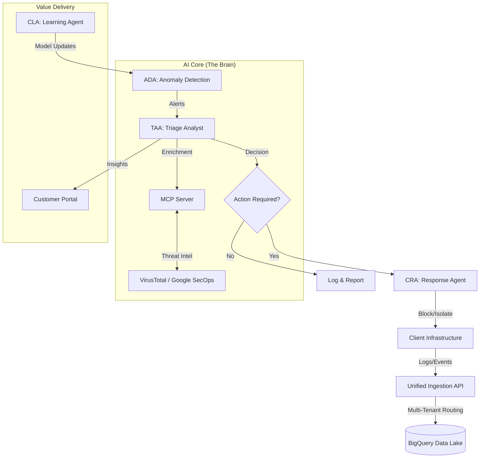

# AI-Driven SOC Platform: Commercial Architecture & Value Proposition

## Executive Summary

The **AI-Driven SOC Platform** is a next-generation security operations solution designed for Managed Security Service Providers (MSSPs). Unlike traditional SOCs that rely heavily on manual analyst effort, this platform leverages **Autonomous AI Agents** and the **Model Context Protocol (MCP)** to deliver scalable, high-speed threat detection and response.

This document outlines the commercial architecture, enabling MSSPs to transform their business model from "hours-based" to "outcome-based" security services.

---

## 1. The Business Value Proposition

### 🚀 For the MSSP (The Provider)
*   **Infinite Scalability**: The multi-tenant architecture allows you to onboard hundreds of clients without linearly increasing headcount.
*   **Higher Margins**: Automate Tier 1 and Tier 2 analysis (90% of workload), reducing operational costs by up to 70%.
*   **New Revenue Streams**: Sell "AI-Agent-as-a-Service" and premium "Autonomous Response" capabilities.
*   **Future-Proofing**: Built on MCP (Model Context Protocol), enabling seamless integration with future AI tools and LLMs.

### 🛡️ For the Client (The End User)
*   **Mean Time to Respond (MTTR) in Seconds**: AI agents detect and contain threats instantly, 24/7.
*   **Transparency**: Real-time dashboards show exactly what the AI is doing, building trust.
*   **Cost-Effective**: Enterprise-grade security at a fraction of the cost of building an internal SOC.

---

## 2. Commercial Architecture

The platform is architected to support a multi-tiered service model.

### Tier 1: "Essential" (Automated Detection)
*   **Features**: 
    *   Event Ingestion via API.
    *   ADA (Anomaly Detection Agent) scanning.
    *   Basic Email Alerts.
*   **Target**: SMEs needing compliance and basic monitoring.
*   **Tech Stack**: BigQuery + ADA Service.

### Tier 2: "Professional" (AI Analysis)
*   **Features**: 
    *   All Tier 1 features.
    *   **TAA (Triage & Analysis Agent)**: AI investigates alerts, reducing false positives.
    *   **MCP Integration**: AI queries external threat intel (VirusTotal, AbuseIPDB) automatically.
    *   Interactive Customer Portal.
*   **Target**: Mid-market companies requiring active defense.
*   **Tech Stack**: ADA + TAA + MCP Server.

### Tier 3: "Enterprise" (Autonomous Response)
*   **Features**: 
    *   All Tier 2 features.
    *   **CRA (Containment Response Agent)**: Automated blocking of IPs, isolation of hosts.
    *   **CLA (Continuous Learning Agent)**: Custom model training on client data.
    *   Dedicated Tenant Resources.
*   **Target**: Large enterprises with critical infrastructure.
*   **Tech Stack**: Full Multi-Agent Swarm (ADA, TAA, CRA, CLA).

### Tier 4: "Quantum Vanguard" (Premium Differentiator)
*   **Features**:
    *   All Tier 3 features.
    *   **Quantum Threat Detection**: Uses Qiskit-based agents to detect non-linear attack patterns ("Low and Slow").
    *   **Post-Quantum Readiness**: Identification of weak cryptographic assets.
*   **Target**: Defense contractors, Banks, Government.
*   **Tech Stack**: Hybrid Classical-Quantum Q-Agent + IBM Quantum Cloud.

---

## 3. Technical Architecture for Sales

This diagram illustrates how the platform delivers value at every stage of the security lifecycle.

### Key Differentiators (Sales Talking Points)

1.  **The "Agentic" Advantage**: We don't just run scripts; we deploy **AI Agents**.
    *   *Analogy*: Scripts are like a checklist; Agents are like an employee who can think, research, and make decisions.
    *   *Benefit*: Handles complex, novel threats that rules-based systems miss.

2.  **Quantum-Enhanced Defense ("The Vanguard Advantage")**:
    *   **What it is**: We use IBM Quantum processors to analyze complex threat data vectors.
    *   **Why it matters**: Classical computers struggle with "feature entanglement" in complex attacks. Quantum kernels can separate these patterns, detecting threats that are mathematically invisible to standard AI.

2.  **Model Context Protocol (MCP)**:
    *   *What it is*: A universal standard for AI tools.
    *   *Why it matters*: It means our platform isn't a "walled garden." We can plug in *any* security tool (Chronicle, Splunk, CrowdStrike) and our AI agents can immediately use it.

3.  **Continuous Learning (CLA)**:
    *   The system gets smarter with every alert. If a human analyst marks a false positive, the CLA retrains the models overnight. Your security posture improves daily, automatically.

---

## 4. Monetization Strategy

### API-First Integration
The **MSSP Platform Server** exposes a clean REST API (`/api/v1/events`, `/api/v1/tenants`).
*   **Sell Integration**: Charge setup fees to integrate with client's existing IT stack.
*   **Volume Pricing**: Charge per GB of ingested logs or per EPS (Events Per Second).

### Agentic Add-Ons
*   **"Investigate with AI" Button**: Charge per on-demand deep investigation triggered by the client.
*   **Custom Compliance Reports**: AI-generated reports for GDPR/SOC2, sold as a monthly add-on.

---

## 5. Advanced Ecosystem Integrations

Expand your service portfolio with our cutting-edge ecosystem modules:

### 🌐 Digital Twin SOC (Situational Awareness)
*   **What it is**: A real-time 3D visualization of your client's entire network and security posture.
*   **Value**: Transforms abstract logs into a visual "War Room" experience. Instantly spot compromised nodes and attack paths in a 3D space.
*   **Reference**: [Digital Twin Showcase](https://github.com/ghifiardi/digital_twin_SOC_sowcase)

### 🛡️ Proactive Security Orchestrator (DevSecOps)
*   **What it is**: A "Shift-Left" engine that integrates directly into the client's development pipeline (CI/CD).
*   **Value**: Stops vulnerabilities *before* they reach production. Uses **Semgrep** and **Gitleaks** to audit code and secrets automatically.
*   **Reference**: [Proactive Orchestrator](https://github.com/ghifiardi/proactive-security-orchestrator)

### 👁️ Unified Cyber-Physical Defense (YOLO)
*   **What it is**: AI-powered computer vision integration for physical security feeds (CCTV) and customer touchpoints.
*   **Use Case**: **Fraud & Social Engineering Defense** (Telco/Banking).
*   **Key Capabilities**:
    *   **Face Spoofing & Liveness Detection**: Prevents identity fraud using photo/video replay or masks.
    *   **Device Presence Detection**: Detects unauthorized recording devices (phones/cameras) pointing at agent screens, a key indicator of **SIM Swap Fraud** or coercion.
    *   **Contextual Risk Signals**: Correlates physical behaviors with KYC data to flag high-risk interactions in real-time.
*   **Value**: Bridges the gap between cyber and physical worlds. Detects unauthorized physical access or security breaches that could precede a cyber attack.
*   **Reference**: [YOLO Integration](https://github.com/ghifiardi/YOLO)

### 🏦 AI Fraud Modelling Dashboard (Banking & Fintech)
*   **What it is**: A specialized module for real-time transaction monitoring and fraud detection.
*   **Use Case**: **Financial Crime Prevention & Blockchain Analytics**.
*   **Key Capabilities**:
    *   **Multi-Agent Intelligence Network**: Connects with regional agents (Jakarta Bank Consortium, Singapore Regional Agent) to share fraud patterns like BI-FAST abuse and money laundering.
    *   **Real-Time Risk Scoring**: Uses ensemble models (Random Forest, Isolation Forest) to score transactions in milliseconds.
    *   **Blockchain Integration**: Capable of monitoring crypto-asset flows and correlating them with fiat transactions for comprehensive AML (Anti-Money Laundering).
*   **Value**: Reduces false positives in transaction monitoring and enables collaborative defense against global financial fraud rings.
*   **Reference**: [Fraud Modelling Dashboard](https://github.com/ghifiardi/fraud_modelling_dashboard)

### ⚛️ IBM Quantum Threat Detection (BETA)
*   **What it is**: A bridge to IBM's Quantum Cloud using Qiskit Runtime.
*   **Use Case**: **Complex Anomaly Detection & Cryptographic Agility**.
*   **Key Capabilities**:
    *   **Q-Kernels**: Maps network traffic into high-dimensional Hilbert space to find anomalies in "clean" looking traffic.
    *   **Future-Proofing**:Positions the MSSP as a leader in Post-Quantum Cryptography (PQC) readiness.
*   **Value**: The ultimate sophisticated defense layer for high-value targets.

---

## 6. Conclusion

This architecture is not just a tool; it is a **business enabler**. It allows MSSPs to break the linear relationship between revenue and headcount, delivering superior security outcomes with software economics.
