# Multi-Agent SOC Workflow Diagrams

## Complete System Architecture

```mermaid
graph TB
    subgraph "Data Sources"
        SIEM[SIEM Events<br/>BigQuery]
        LOGS[Security Logs<br/>Network Traffic]
    end
    
    subgraph "AI Agent Layer"
        ADA[ADA<br/>Anomaly Detection Agent<br/>🔍 Detection & Scoring]
        TAA[TAA<br/>Triage & Analysis Agent<br/>🧠 LLM Analysis]
        CRA[CRA<br/>Containment Response Agent<br/>🛡️ Automated Response]
        CLA[CLA<br/>Continuous Learning Agent<br/>📚 Model Improvement]
    end
    
    subgraph "Orchestration Layer"
        LANG[LangGraph<br/>Workflow Engine<br/>🔄 State Management]
        PUB[Pub/Sub<br/>Message Broker<br/>📡 Async Communication]
    end
    
    subgraph "Data Layer"
        BQ[BigQuery<br/>Data Warehouse<br/>📊 Analytics & Storage]
        FS[Firestore<br/>State Management<br/>💾 Agent State]
        CS[Cloud Storage<br/>Model Artifacts<br/>🗄️ ML Models]
    end
    
    subgraph "Monitoring Layer"
        DASH1[Production CLA Dashboard<br/>📊 Service Monitoring]
        DASH2[TAA-CRA Integration Dashboard<br/>🔗 Integration Status]
        ALERT[Alerting System<br/>🚨 Notifications]
    end
    
    %% Data Flow
    SIEM --> ADA
    LOGS --> ADA
    
    %% Agent Communication
    ADA -->|Alerts| TAA
    TAA -->|Containment Requests| CRA
    TAA -->|Feedback| CLA
    TAA -->|Reports| DASH2
    
    %% Orchestration
    LANG --> ADA
    LANG --> TAA
    LANG --> CRA
    
    %% Message Broker
    PUB --> ADA
    PUB --> TAA
    PUB --> CRA
    PUB --> CLA
    
    %% Data Persistence
    BQ --> ADA
    BQ --> TAA
    BQ --> CLA
    FS --> TAA
    FS --> CRA
    CS --> CLA
    
    %% Monitoring
    ADA --> DASH1
    CLA --> DASH1
    TAA --> DASH2
    CRA --> DASH2
    
    %% Learning Loop
    CLA -->|Model Updates| ADA
    CLA -->|Parameter Updates| TAA
```

## Detailed Agent Interaction Flow

## TAA LangGraph Workflow Detail

## Pub/Sub Message Flow

## Data Storage Architecture

## Service Deployment Architecture

## Monitoring & Observability Stack

---

## How to Use These Diagrams

1. **Copy the Mermaid code** from any diagram above
2. **Paste into a Mermaid editor** like:
   - [Mermaid Live Editor](https://mermaid.live/)
   - [GitHub/GitLab** (native support)
   - [Notion** (with Mermaid plugin)
   - [VS Code** (with Mermaid extension)

3. **Customize as needed** for your specific documentation or presentations

These diagrams provide a comprehensive visual representation of your multi-agent SOC architecture and can be used in documentation, presentations, or for onboarding new team members.
