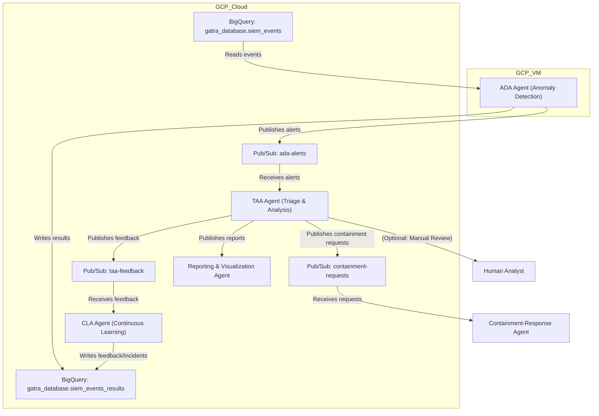

# Triage and Analysis Agent (TAA) Documentation

## Overview
The Triage and Analysis Agent (TAA) is a core component of the AI-driven SOC architecture. It receives security alerts from the Anomaly Detection Agent (ADA), enriches and analyzes them using an LLM, and coordinates feedback, containment, and reporting actions.

## Architecture & Workflow

- **ADA** detects anomalies in BigQuery data and publishes alerts to the `ada-alerts` Pub/Sub topic.
- **TAA** subscribes to `ada-alerts`, processes each alert, and:
    - Enriches the alert with context and threat intelligence
    - Analyzes the alert using a local LLM (Mistral) or Vertex AI
    - Classifies the alert (true/false positive, severity, confidence)
    - Publishes feedback to the `taa-feedback` topic
    - Publishes containment requests to the `containment-requests` topic (if needed)
    - Publishes reports to the Reporting & Visualization Agent (RVA)
    - Optionally flags for manual review
- **CLA** (Continuous Learning Agent) subscribes to feedback and updates detection models.
- **Containment-Response Agent** subscribes to containment requests and takes action.

## Integration Points

- **BigQuery**: Source of raw events and results storage
- **Pub/Sub Topics**:
    - `ada-alerts`: ADA → TAA
    - `taa-feedback`: TAA → CLA
    - `containment-requests`: TAA → Containment-Response Agent
    - `taa-manual-review`: TAA → Human Analyst (optional)
- **Reporting & Visualization Agent (RVA)**: Receives reports from TAA

## Operational Instructions

### Running the TAA Service
1. Ensure all required Pub/Sub topics and subscriptions are created.
2. Start the TAA service:
   ```sh
   python3 taa_service.py > taa_service.log 2>&1 &
   ```
3. Monitor logs:
   ```sh
   tail -f taa_service.log
   ```

### Automatic ADA Alert Publishing (for testing)
- Start the ADA alert publisher service:
  ```sh
  python3 ada_alert_publisher_service.py > ada_alert_publisher.log 2>&1 &
  ```

### Dashboard
- Run the Streamlit dashboard to visualize TAA activity:
  ```sh
  python3 -m streamlit run taa_dashboard.py
  ```
  Then open [http://localhost:8501](http://localhost:8501) in your browser.

## Example Workflow Diagram



## Log Monitoring
- Feedback and containment actions are logged as:
  - `Published feedback for alert ...`
  - `Published containment request for alert ...`

## Human-in-the-Loop
- Alerts with low confidence or high severity can be published to `taa-manual-review` for manual analyst review.

## Extending the System
- Add more Pub/Sub topics or BigQuery tables as needed for new agents or reporting needs.
- Integrate with additional dashboards or SIEM tools for advanced visualization.

---

*This documentation can be converted to DOCX using pandoc:*
```sh
pandoc taa_documentation.md -o taa_documentation.docx
``` 