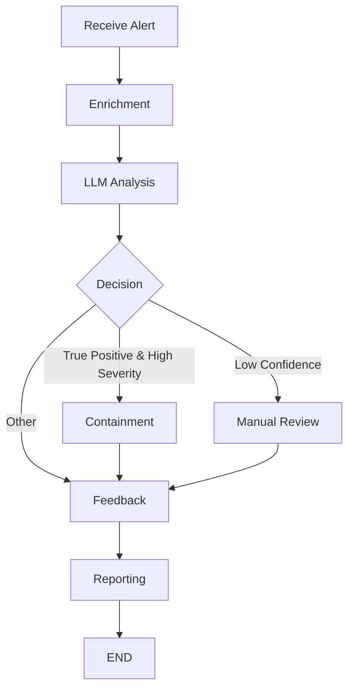

# Triage & Analysis Agent (TAA) — LangGraph Refactor Documentation

## 1. Overview

The Triage & Analysis Agent (TAA) is a core component of a multi-agent, AI-driven SOC system. It ingests alerts (from ADA), enriches and analyzes them (using a local LLM), and routes them for containment, feedback, or manual review. The workflow is now orchestrated using [LangGraph](https://github.com/langchain-ai/langgraph) for modularity and maintainability.

---

## 2. Workflow Architecture

**Main Steps:**
1. **Receive Alert**: Ingests an alert (from Pub/Sub or test input).
2. **Enrichment**: Adds contextual data to the alert.
3. **LLM Analysis**: Uses a local LLM (e.g., Mistral) to assess the alert.
4. **Decision (Router)**: Decides the next step based on LLM output:
    - **Containment**: For high-severity, true positives.
    - **Manual Review**: For low-confidence results.
    - **Feedback**: For other cases.
5. **Feedback**: Publishes feedback for learning and reporting.
6. **Reporting**: Finalizes the process (e.g., logs, dashboards).

**Workflow Diagram (Mermaid):**


---

## 3. Issues Encountered & Solutions

### a. **Virtual Environment Corruption**
- **Issue:** Merge conflicts in `venv/bin/activate` and `venv/bin/pip` caused activation and pip errors.
- **Solution:**  
  - Inspected and removed merge conflict markers.
  - Ultimately deleted and recreated the virtual environment, then reinstalled dependencies.

### b. **LangGraph Router Node Error**
- **Issue:**  
  - The router node (`decision_node`) returned only the next node name (a string), but LangGraph expects a tuple `(next_node, state)`.
  - This caused downstream nodes to receive a string instead of the expected state dictionary, resulting in `TypeError: 'str' object does not support item assignment`.
- **Solution:**  
  - Updated the router node to return `(next_node, state)`.
  - Updated the conditional routing lambda to extract the next node name from the tuple.

### c. **Multiple Outgoing Edges from Router**
- **Issue:**  
  - Multiple direct edges from the router node caused LangGraph to attempt parallel execution, which is not supported for this use case.
- **Solution:**  
  - Used `add_conditional_edges` to ensure only one path is followed after the router.

### d. **Dependency/Import Issues**
- **Issue:**  
  - `Import "langgraph.graph" could not be resolved` due to missing or broken installation.
- **Solution:**  
  - Recreated the virtual environment and reinstalled all dependencies.

---

## 4. Current Features

- **Modular Workflow:**  
  Each step (enrichment, LLM, decision, etc.) is a separate node, making the workflow easy to extend and maintain.

- **LLM-Driven Decision:**  
  Uses a local LLM to determine alert severity, confidence, and whether it's a true positive.

- **Dynamic Routing:**  
  The decision node routes alerts to containment, manual review, or feedback based on LLM output.

- **Feedback Loop:**  
  Publishes feedback for continuous learning and reporting.

- **Logging:**  
  Each step logs its activity for traceability and debugging.

- **Testable:**  
  The workflow can be invoked with test data for rapid iteration.

---

## 5. Recommendations for Improvement

1. **Integrate with Pub/Sub:**
   - Connect the entrypoint to a Pub/Sub subscription for real-time alert ingestion.
   - Publish feedback and reporting results to appropriate Pub/Sub topics.

2. **Human-in-the-Loop (HITL):**
   - Implement a manual review queue (e.g., via Firestore or a dashboard) for alerts routed to manual review.

3. **Error Handling & Resilience:**
   - Add try/except blocks and error logging in each node.
   - Implement retry logic for transient failures (e.g., Pub/Sub, LLM).

4. **Configurable Routing Logic:**
   - Make thresholds (e.g., confidence, severity) configurable via environment variables or a config file.

5. **Metrics & Monitoring:**
   - Add metrics (e.g., number of alerts processed, time per step) for observability.
   - Integrate with a dashboard for live monitoring.

6. **Unit & Integration Tests:**
   - Add tests for each node and for the full workflow.

7. **Documentation & Examples:**
   - Expand documentation with example alert payloads and expected outputs.
   - Provide a quickstart guide for new contributors.

8. **Security & Access Control:**
   - Ensure sensitive data is handled securely.
   - Add authentication/authorization for any manual review or dashboard components.

---

## 6. Example: How to Run the Workflow

```bash
# Activate the virtual environment
source venv/bin/activate

# Run the agent with test data
python taa_langgraph_agent.py
```

---

## 7. References

- [LangGraph Documentation](https://github.com/langchain-ai/langgraph)
- [Google Cloud Pub/Sub Python Client](https://cloud.google.com/pubsub/docs/publisher)
- [Mistral LLM](https://mistral.ai/)

---

**For further improvements or integration, see the recommendations above or ask for implementation help!** 